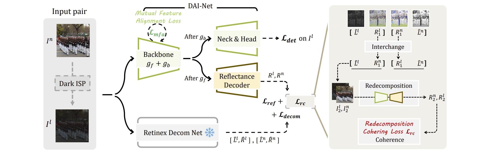

<p align="center">
  <h1 align="center">Boosting Object Detection with Zero-Shot Day-Night Domain Adaptation
</h1>
  <p align="center">
    <a href="https://zpdu.github.io/">Zhipeng Du</a>
    ·
    <a href="https://sites.google.com/site/miaojingshi/home">Miaojing Shi</a>
    ·
    <a href="https://jiankangdeng.github.io/">Jiankang Deng</a>
  </p>
  


PyTorch implementation of **Boosting Object Detection with Zero-Shot Day-Night Domain Adaptation**. (CVPR 2024) [[Page](https://zpdu.github.io/DAINet_page/) | [Paper](https://arxiv.org/abs/2312.01220)]




## 🔨 To-Do List

1. - [x] release the code regarding the proposed model and losses.
3. - [x] release the evaluation code, and the pretrained models.

3. - [x] release the training code.

## :rocket: Installation

Begin by cloning the repository and setting up the environment:

```
git clone https://github.com/ZPDu/DAI-Net.git
cd DAI-Net

conda create -y -n dainet python=3.7
conda activate dainet

pip install torch==1.13.1+cu117 torchvision==0.14.1+cu117 -f https://download.pytorch.org/whl/torch_stable.html

pip install -r requirements.txt
```

## :notebook_with_decorative_cover: Training

#### Data and Weight Preparation

- Download the WIDER Face Training & Validation images at [WIDER FACE](http://shuoyang1213.me/WIDERFACE/).
- Obtain the annotations of [training set](https://github.com/daooshee/HLA-Face-Code/blob/main/train_code/dataset/wider_face_train.txt) and [validation set](https://github.com/daooshee/HLA-Face-Code/blob/main/train_code/dataset/wider_face_val.txt).
- Download the [pretrained weight](https://drive.google.com/file/d/1MaRK-VZmjBvkm79E1G77vFccb_9GWrfG/view?usp=drive_link) of Retinex Decomposition Net.
- Prepare the [pretrained weight](https://drive.google.com/file/d/1whV71K42YYduOPjTTljBL8CB-Qs4Np6U/view?usp=drive_link) of the base network.

Organize the folders as:

```
.
├── utils
├── weights
│   ├── decomp.pth
│   ├── vgg16_reducedfc.pth
├── dataset
│   ├── wider_face_train.txt
│   ├── wider_face_val.txt
│   ├── WiderFace
│   │   ├── WIDER_train
│   │   └── WIDER_val
```

#### Model Training

To train the model, run

```
python -m torch.distributed.launch --nproc_per_node=$NUM_OF_GPUS$ train.py
```

## :notebook: Evaluation​

On Dark Face:

- Download the testing samples from [UG2+ Challenge](https://codalab.lisn.upsaclay.fr/competitions/8494?secret_key=cae604ef-4bd6-4b3d-88d9-2df85f91ea1c).
- Download the checkpoints: [DarkFaceZSDA](https://drive.google.com/file/d/1BdkYLGo7PExJEMFEjh28OeLP4U1Zyx30/view?usp=drive_link) (28.0) or [DarkFaceFS](https://drive.google.com/file/d/1ykiyAaZPl-mQDg_lAclDktAJVi-WqQaC/view?usp=drive_link) (52.9, finetuned with full supervision).
- Set (1) the paths of testing samples & checkpoint, (2) whether to use a multi-scale strategy, and run test.py.
- Submit the results for benchmarking. ([Detailed instructions](https://codalab.lisn.upsaclay.fr/competitions/8494?secret_key=cae604ef-4bd6-4b3d-88d9-2df85f91ea1c)).

On ExDark:

- Our experiments are based on the codebase of [MAET](https://github.com/cuiziteng/ICCV_MAET). You only need to replace the checkpoint with [ours](https://drive.google.com/file/d/1g74-aRdQP0kkUe4OXnRZCHKqNgQILA6r/view?usp=drive_link) for evaluation.

# 调试记录
## 2025.1.22
- test输出只有预测txt文件，补充了把预测框绘制出来的步骤
- 简单筛选了一下，置信度小于0.3的不显示，效果很好
- 以上测试用的是作者提供的权重文件，只适用于人脸检测
- _C.TOP_K = 20时，mAP=14.19
- _C.TOP_K = 750时，mAP=14.21
## 2025.1.23
- 修改了部分网络结构

## 2025.3.20
- 损失函数仍然没法下降，感觉应该是金字塔校正的那部分初始化有问题
- 取消了deyolo部分的所有初始化 还是没法收敛
- 取消其他所有的网络，金字塔部分恢复到DENet原始结构，收敛慢但是正常收敛
- 增加正常亮度金字塔对比的高频损失，出现了分类和回归损失消失的问题——学习率过大
- 对DENet权重初始化（加载DENet的权值）
- 把多余的函数套用简化
- 在代码里标注清楚，图像数据都是归一后的值


## 📑 Citation

If you find this work useful, please cite

``` citation
@inproceedings{du2024boosting,
  title={Boosting Object Detection with Zero-Shot Day-Night Domain Adaptation},
  author={Du, Zhipeng and Shi, Miaojing and Deng, Jiankang},
  booktitle={Proceedings of the IEEE/CVF Conference on Computer Vision and Pattern Recognition},
  pages={12666--12676},
  year={2024}
}
```

or

``` citation
@article{du2023boosting,
  title={Boosting Object Detection with Zero-Shot Day-Night Domain Adaptation},
  author={Du, Zhipeng and Shi, Miaojing and Deng, Jiankang},
  journal={arXiv preprint arXiv:2312.01220},
  year={2023}
}
```


## 🔎 Acknowledgement

We thank [DSFD.pytorch](https://github.com/yxlijun/DSFD.pytorch), [RetinexNet_PyTorch](https://github.com/aasharma90/RetinexNet_PyTorch), [MAET](https://github.com/cuiziteng/ICCV_MAET), [HLA-Face](https://github.com/daooshee/HLA-Face-Code) for their amazing works!

